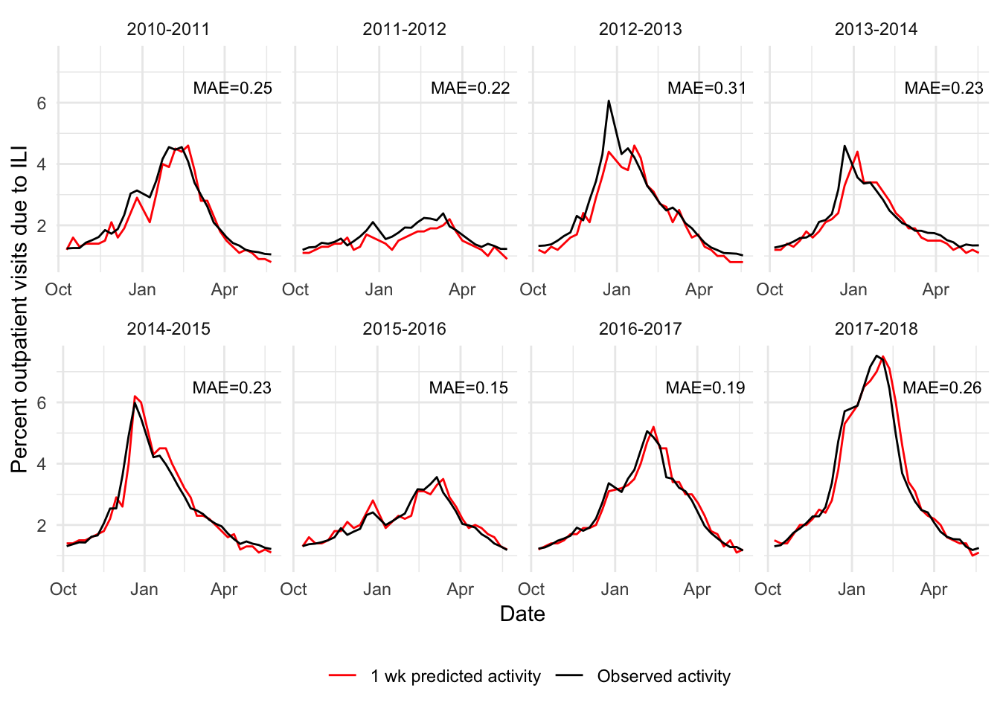

Influenza Forecasting - The Data Incubator Capstone Proposal
============================================================

Introduction
------------

Seasonal influenza results in a large disease burden each winter in the United States, with billions in economic costs, millions of hours of lost productivity, millions of doctor visits, and thousands of fatalities. While the occurrence of a seasonal influenza epidemic is predictable, the temporal and spatial dynamics of the epidemic vary substantially from year to year. Accurate predictions of influenza activity over the coming weeks can allow the general public, businesses, doctors, health care administrators, and public health officials to act in ways to mitigate the impact, such as by influencing health care seeking behavior, informing prophylactic treatment, or ensuring adequate staffing of health care facilities. To address this, my capstone project will use data from the Centers for Disease Control and Prevention (CDC) and Google Trends to create short-term predictions of influenza activity at multiple geographical resolutions.

Project goal
------------

Upon completion of The Data Incubator, I will have completed models to forecast influenza activity 1 to 4 weeks ahead at three resolutions - national, the 10 Health and Human Services (HHS) Regions (each composing multiple states), and those individual states for which influenza data are available (all except Florida as of this proposal). By creating a web application to host these forecasts, potential users will be able to access the forecasts that are of interest to them.

Data sources and acquisition
----------------------------

The main data source for my project, and the target value of interest for my forecasts, comes from the CDC's US Outpatient Influenza-like-illness Surveillance Network, or ILINet. Each week, ~3500 outpatient providers report the number of patients they have seen with influenza like illness (ILI), defined as a fever &gt; 100° and cough or sore throat, as well as the total number of patients seen. From this, the percentage of outpatient visits due to ILI is calculated. Weekly ILINet data are available at the national, regional, and state level going back to at least the beginning of the 2010/2011 influenza season. Of note, late reports by providers to CDC can result in revisions, known as *backfill*, to initially reported ILINet values; for example, a value originally reported as 3.2% could increase to 3.5% or decrease to 2.9% in later reports. In addition to ILINet data, I make use of CDC's virologic surveillance data, which gathers weekly information on which influenza virus strains are circulating. Both CDC data sources are publicly available through CDC's FluView API, which is accessed via R using the `cdcfluview` package. Finally, I use Google Trends data on the prevalence of searches for 'flu', accessed using the `gtrendsR` package.

Model structure
---------------

As previous research has illustrated the value of ensemble approaches to forecasting infectious diseases, I use a weighted ensemble of three separate component models. The first component model included is a naive historical average model. A Gaussian kernel density estimate based on previous ILINet data is used to create predictions for each week of the upcoming season. The second component model is a historical average model weighted by the cumulative influenza A virus subtype prevalence observed. Separate Gaussian kernel density estimates based on previous ILI data were fit for H1N1 and H3N2 dominant seasons by weighting observed ILI values by the cumulative prevalence of that virus subtype in the season. Predictions are created by weighting those two kernel density estimates by the observed cumulative prevalence of the influenza A virus subtypes to date in the current season. The third and final component model is a dynamic harmonic regression model, using Fourier terms to capture the seasonality of the ILI trend along with ARIMA errors for short-term correlation. Region-specific models include some combination of cumulative influenza subtype prevalence, national Google trends data, regional Google trends data, and estimates of ILI backfill as predictors in the model. The specific model structure is fit via cross validation of forecasts from the 2010-2011 through 2017-2018 seasons, with training forecasts based solely on data that would have been available at the time of the forecast. Prediction intervals for the dynamic harmonic regression model are calculated via bootstrapping.

The final model is a weighted ensemble of the three component models based on leave-one-season-out cross validation of forecasts from the 2010-2011 through 2017-2018 seasons, with separate model weights estimated for each month using a degenerate expectation maximization algorithm. From the final forecast, I can generate point forecasts with corresponding prediction intervals, as well as purely probabilistic forecasts.

The plot below illustrates the accuracy of the 1-week ahead forecasts on the training data from 2010-2011 through 2017-2018 for national-level forecasts. Mean absolute error (MAE) ranges from 0.15 to 0.31. Overall, the training forecasts track the training data well, illustrating the potential for these forecasts in real-time.

Observed training data and predicted 1 week ahead forecasts during the training period, US National

Current performance in 2018/2019
--------------------------------

During the ongoing 2018/2019 influenza season, I have used the model described above to make weekly prospective forecasts of influenza activity at the national and regional level. Snapshots of prospective forecasts for national level influenza activity made based on data from four dates are illustrated in the plot below. Performance of the 1 and 2 week ahead forecasts is quite good, reflected in MAE values of 0.28 and 0.4, respectively. Forecasts of influenza 3 and 4 weeks ahead are less accurate, with MAE values of 0.49 and 0.49, though it remains to be seen whether they will predict the season's second inflection point correctly.

Prospective forecasts of national influenza activity at four weeks of the 2018/2019 influenza season

Future work @ TDI
-----------------

As a Fellow at The Data Incubator, I plan on expanding the work I have already done to include forecasts of ILI for individual states. Patterns of influenza activity are not uniform across the entire nation and one state can be having a severe season while another has a mild season. By creating forecasts at the state level, I can provide more relevant insights to public health and health care officials, helping them to ensure adequate materials and personnel are available to respond to the predicted activity. The general public can also benefit from such forecasts, as they can help influence health-care seeking behavior if influenza activity is predicted to be high. To help disseminate forecasts and make them easily accessible, I plan to build an interactive web application allowing users to view forecasts for any level of spatial resolution at any point in the influenza season, as well as access metrics of forecast performance based on observed data. Effective visualizations of the forecasts could also be embedded on or linked to from other sites, increasing the reach and influence of the forecasts.
